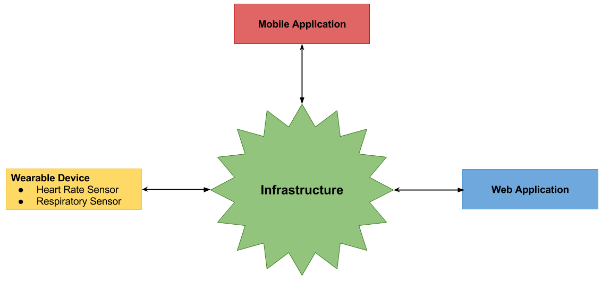
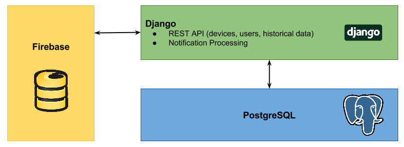

# Introduction
The purpose of the UberVest project is to design a wearable device - a vest - providing health monitoring functionality to the wearer. The primary aim of the vest is hearth rate monitoring and respiratory monitoring. Additionally, the project aims to deliver storage of sensory readings as well as analysis of the data in order to provide relevant and easy to use information for the wearer. Furthermore, sensory readings are communicated in real time with a monitoring application to allow real time feedback as well as monitoring.

In order to achieve the goal, the project is composed of various pieces of technology: wearable hardware, mobile application, data storage and data exposure service and a website with live monitoring.

In this report, I will focus on the design and implementation of the project architecture as well as the data storage and data exposure services which I have been involved in.

# Requirements
Firstly, on a high level, the requirements for the project consisted of finding a suitable infrastructure design to be able to send, process, store and expose sensory readings from the hardware component. The requirements for the project can be broken down into two categories: functional requirements and non-functional requirements.

## Functional Requirements
* The sensory readings from the hardware device should be stored
* The sensory readings from the hardware device should be uploaded in real time or as close to real time as possible
* The sensory readings should be available on all devices (mobile application, web) and should reflect realtime readings
* The readings should be analyzed and analyzed data exposed for retrieval

## Non-functional Requirements
* We should be able to access the data from anywhere on the internet, not just inside a private network
* In the development process, we should aim to keep the cost of running our services free

Secondly, further details of the requirements were discovered in the process of development and implementation and will be discussed in their respective relevant sections.

# Design
Taking the above requirements into consideration, a simple explanation of the required design would be to store, analyze and retrieve information in real time. Firstly, given the nature of the system, our primary focus was on supporting real time capabilities in our system. Secondly, our focus was on the ability to provision storage and computing capacity to analyze the data.

The design process was done in steps with review of each step against both the functional and non-functional requirements. I will outline the design process below.

## Understand the devices
Firstly, it is essential to understand what kind of devices will need to be able to connect and access the infrastructure. The figure below outlines the different devices required to interact with the infrastructure. There are two devices required to interact with the infrastructure, both with different application programming interface.

### Device Requirements
Firstly, the mobile application requires to communicate with the hardware device in order to relay sensory readings to the infrastructure. The communication protocol between the smart phone and the wearable is over Bluetooth. The underlying application implementation is in Java.

Secondly, the web application uses HTML, CSS and Javascript and communicates through the HTTP protocol.

Therefore, a sensible communication protocol between the mobile application and the web application is HTTP, providing a standardized implementation and widespread adoption rate in the industry. Consequently, the infrastructure implementation is required to implement its interface to support HTTP.

## Storage
The nature of the sensory readings from the wearable is the driving factor for the required type of storage used. For a given type of sensor (hearth rate, respiratory), we are mainly interested in the time series produced, therefore, we are primarily interested in a pair of data <timestamp>:<value>. Consequently, due to no inherent relationship nature in our sensory data we decided to use a NoSQL database as a storage layer.

## Realtime Communication
Being an essential functional requirement of this project, the ability to effectively utilize real time updates is essential. Real time updates can be effectively implemented in the browser using web sockets while real time updated on the backend systems can be implemented using push notifications with new data inserted. Therefore, an ideal real time system used would be one supporting both websockets and some sort of a notification stream. We have decided to use FireBase [1] as the underlying storage layer. Firebase supports storage of non-relational data either as a key-value pairs in a given 'table' or as a list of values. Furthermore, FireBase provides a JavaScript implementation of a websocket client capable of listening to data changes in the storage layer itself as well as a notification stream. Threfore, FireBase satisfied both our needs for storage and real time communication capability. Furthermore, FireBase provided a free usage plan which suited our non-functional requirements of keeping the services free.

We have also evaluated other options for storage with real time communciation built into it. The table below outlines the aspects we considering during evaluation.

|Database|Pricing|Deployment Model|Ease of realtime updates|Perceived Ease of Use|
|---|---|---|---|---|
|FireBase [1]|Free|Hosted|Built-in|Easy|
|Redis [2]|Free|User managed|Additional library required|Difficult due to deployment management|
|RethinkDB [3]|Free|User managed|Built-in|Difficult due to deployment management|

Given that Firebase provided a hosted solution with built in support for realtime updates, it was decided to be the best choice for the project development model where we wanted to spend less time on infrastructure setup and more on development. Furthermore, FireBase API allows us to send data directly into FireBase from the mobile application without requiring to build an intermediate layer, removing complexity of the system.

## API
Having decided on the underlying storage model for the sensory data, we had a clearer picture of our requirements for the API, the main processing unit of the application. The API is responsible for retrieval of raw data from the FireBase storage layer and transforming the data - applying processing and analytics - in order to be able present the data in a sensible form to the users on the website.

Functionally, we require the API to be easy to use and sufficiently performant so that it would be able to keep up with the potential load from the users. Additionally, the API also needed to be responsible for managing different devices registered with the service as well as management of users and storage of historical data. 

As a direct requirement of the API, we introduce another storage layer, a relational PosgreSQL database in order to help us keep track of users and devices as well as processed data (historical) data. The decision for PosgreSQL came from the analysis that our user and device data had inherent relationships and therefore the usage of a relational database would help us better model the problem. PosgreSQL specifically was chosen for its long standing place in the industry providing a wealth of information online in case of problems.

For the API itself, we picked Python and the Django Framework for its simplicity of ORM integration with PosgreSQL. Additionally, Python is a language the whole team is familiar with as well as it allows us to iterate on a solution faster than a system written in Java or other compiled language would.

## The Infrastructure
Given the outline of the components above, the infrastructure looks as follows:

* [1] [FireBase](https://www.firebase.com/)
* [2] [Redis](http://redis.io/)
* [3] [RethinkDB](http://rethinkdb.com/)

